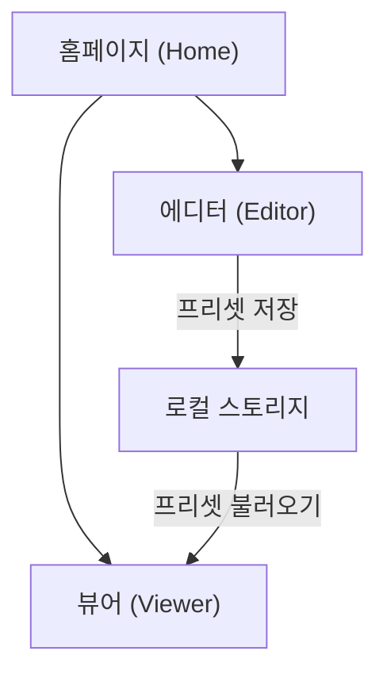

<aside>
💤

**한 줄 요약** — 기본은 웹 슬라이드 제작 사이트지만, **자리비움(AFK) 상태를 빠르게 전환**하는 데 기능이 특화된 버전.

</aside>

# 1. 프로젝트 개요

- **목적**: 사용자가 자리를 뜰 때 화면에 전체화면으로 띄워둘 **자리비움 디스플레이**를 만드는 웹 도구.
- **기획 의도**: 자리를 뜰 때 화면을 띄워두고, 복귀하면 즉시 종료할 수 있도록 돕는 것. 자리를 비울 때마다 사유(프리셋)를 빠르게 전환.
- **데이터**: 서버/DB 없이 브라우저 **로컬 스토리지**에 저장. export/import로 백업·이전 가능.
- **배포**: **GitHub Pages** 기반 정적 사이트.

# 2. 사이트 구조

전체는 하나의 정적 사이트이며, 홈페이지를 진입점으로 에디터와 뷰어로 나뉨.

## 2-1. 홈페이지 (Home)

- 사이트 진입점. 프로젝트 소개 + 에디터 / 뷰어로 이동하는 허브.
- 저장된 프리셋(슬라이드 세트) 목록과 최근 항목 표시.
- 프리셋 선택 → 바로 뷰어 실행 또는 에디터로 편집.
- 데이터 **export / import** 진입점.

## 2-2. 에디터 (Editor)

- 슬라이드(프리셋)를 제작·편집하는 페이지.
- 슬라이드 단위 구성 요소:
    - 배경(단색 / 그라데이션 / 이미지)
    - 사유 텍스트 (예: "잠시 자리 비움", "식사 중", "회의 중")
    - 아이콘 / 이모지
    - (선택) 타이머·복귀 예정 시각 표시
- 슬라이드 추가 / 삭제 / 순서 변경(드래그).
- 편집 내용은 **로컬 스토리지에 자동 저장**.
- 프리셋 단위 **export / import (JSON)**.

## 2-3. 뷰어 (Viewer)

전체화면 자리비움 디스플레이. 일반 슬라이드쇼처럼 보이되, **빠른 상태 전환**에 특화되도록 조작 방식을 재정의함.

- 기본 페이지 넘김 키를 그대로 두지 않고 **가로채서(hijack)** 아래처럼 동작:
    - 방향키 / 화면 좌우 드래그(터치) / 마우스 스크롤 → 상단에 **UI 오버레이**가 잠깐 등장.
    - 오버레이에는 `[2이전 - 1이전 - 현재 - 다음 - 다다음]` 슬라이드의 **썸네일 프리뷰**가 둥둥 떠다님.
    - 좌우로 넘기다 **2초 이상 정지**하면 그 슬라이드로 화면이 전환됨.
- 마우스를 화면 **위 끝**까지 가져가거나 터치로 **아래로 끌면**, 전체 슬라이드 목록이 **그리드**처럼 펼쳐져 한눈에 선택 가능.
- 복귀 시 즉시 종료(전체화면 해제 / 홈 복귀).

# 3. 데이터 모델

서버 없이 브라우저 로컬 스토리지에 JSON으로 저장.

| 단위 | 내용 |
| --- | --- |
| Preset (프리셋) | 슬라이드 세트 하나. 이름, 생성/수정 시각, 슬라이드 배열 포함 |
| Slide (슬라이드) | 배경, 사유 텍스트, 아이콘/이모지, 타이머 등 개별 화면 정보 |
| Export / Import | 프리셋을 JSON 파일로 내보내기·불러오기 (백업 및 기기 간 이전) |

# 4. 배포 (GitHub Pages)

정적 파일(HTML/CSS/JS)만으로 동작하도록 설계.

- [ ]  프로젝트 루트 폴더 아래 'web' 폴더에 HTML/CSS/JS 파일을 구성
- [ ]  `index.html`(홈) / `editor.html` / `viewer.html` 구조 정리
- [ ]  상대 경로로 에셋 참조 (Pages 서브경로 대응)
- [ ]  `main` 브랜치 또는 `/docs` 폴더를 Pages 소스로 지정
- [ ]  배포 후 전체화면·로컬 스토리지 동작 확인

# 5. 기술 스택

- **HTML / CSS / JavaScript** (프레임워크 없는 바닐라 우선, 필요 시 경량 라이브러리 검토)
- 저장소: 브라우저 **로컬 스토리지**
- 전체화면: **Fullscreen API**
- 배포: **GitHub Pages**

# 6. 개발 로드맵

- [ ]  데이터 모델(프리셋/슬라이드) 및 로컬 스토리지 입출력 설계
- [ ]  홈페이지 UI (프리셋 목록 + 이동 허브)
- [ ]  에디터: 슬라이드 CRUD + 자동 저장
- [ ]  export / import (JSON)
- [ ]  뷰어: 전체화면 슬라이드쇼 기본 동작
- [ ]  뷰어: 오버레이 프리뷰 + 2초 정지 전환 로직
- [ ]  뷰어: 그리드 전체 보기
- [ ]  GitHub Pages 배포 및 QA

---

# AGENT MEMORY AREA

## 프로젝트 진행 상황 (여기에 프로젝트 진행 상황을 기록하기)
- 전체 구현 1차 완료 (2026-07-19)
- 모든 페이지(홈/에디터/뷰어) 및 데이터 모델 구현 완료
- 브라우저 테스트 대기 중

## 마지막으로 진행한 작업 (여기에 마지막으로 진행했던 작업을 기록하기)
- CSS --text-tertiary 오타 수정 (#6565850 → #656585)
- AGENT.md 메모리 영역 업데이트

## 현재까지의 작업 요약 (여기에 프로젝트 시작점부터 진행했던 작업들을 전부 기록하기)
- 구현 계획서 작성 및 사용자 승인
- storage.js: 프리셋/슬라이드 데이터 모델, 로컬 스토리지 CRUD, Export/Import, 기본 시드 데이터
- style.css: 다크모드 글래스모피즘 디자인 시스템 (토큰, 버튼, 카드, 모달, 토스트, 인풋, 에디터/뷰어 레이아웃)
- main.js: 토스트 알림, 모달 confirm, 네비게이션 헬퍼, URL 파라미터, 디바운스, 배경 렌더러, 날짜/타이머 포맷
- index.html + home.js: 홈페이지 (히어로, 프리셋 카드 그리드, CRUD, Export/Import)
- editor.html + editor.js: 에디터 (3-column 레이아웃, 슬라이드 CRUD, 배경/텍스트/이모지/타이머 편집, 드래그 정렬, 자동 저장)
- viewer.html + viewer.js: 뷰어 (전체화면, 오버레이 5개 썸네일, 2초 정지→전환, 그리드 뷰, 터치/키보드/마우스 지원)
